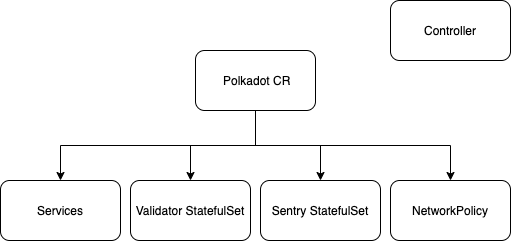

Copyright (c) 2020 Swisscom Blockchain AG
Licensed under MIT License

# PolkaKop - Kubernetes Operator for Polkadot 

Kubernetes Operator for Polkadot Sentry and Validators nodes.

Client - Rust implementation of the Polkadot Host: https://github.com/paritytech/polkadot

The Polkadot Project: https://wiki.polkadot.network/en/

## Polkadot Custom Resource 

The deployable CR (Custom Resource) is called "Polkadot"

## Requirements

* Docker
* Kubernetes kubectl
* Go compiler
* Access to a container registry
* Operator SDK CLI (https://github.com/operator-framework/operator-sdk/blob/master/doc/user/install-operator-sdk.md)
* Optional (SentryAndValidator secure deployment): network plugin, see the Secure Communications section

## How To Run

Deploy to your favorite kubernetes cloud provided cluster (even minikube) a Custom Controller and a Polkadot Custom Resource. The Controller will create and supervise all the necessary resources needed to run a Polkadot Client configuration.

0. Configure your kubectl to work with your desired Kubernetes cluster 
    (e.g. Azure: az aks get-credentials --resource-group myResourceGroup --name myAKSCluster)
1. Clone the repository locally
2. In both deploy/operator.yaml and scripts/compileAndDeployOperator.sh configure the images to point to your favourite Container Registry
3. execute scripts/init.sh

## Clean up resources

Execute scripts/wipeAll.sh

## Polkadot CR Configurable Parameters

* clientVersion: (string)  
Image version of the clients. It is possible to change it at runtime: after the apply, the operator will automatically handle the client version update of the running pods.

* isNetworkPolicyActive: (string)  
If set to "true", the operator will handle the creation and the deployment of a Network Policy object that will ensure the secureness of the Validator (it only affects the Kind "SentryAndValidator"). 

* replicas: (int)  
Allows to decide how many Sentry replicas will be created. In any case, Validator replica size is always hard coded to one and it is not possible to change it to prevent concurrent validation issues.

* clientName: (string)

* CPULimit: (string)  
The format is the usual kubernetes and docker standard (e.g. "0.5")

* memoryLimit: (string)  
The format is the usual kubernetes and docker standard (e.g. "500Mi")

* nodeKey: (string)  
Identity of the node, private (e.g. "0000000000000000000000000000000000000000000000000000000000000013")

* kind: Sentry | Validator | SentryAndValidator (string)  
Desired deployable configuration:
    * Sentry: deploy a Sentry only configuration
    * Validator: deploy a Validator only configuration
    * SentryAndValidator: deploy a Sentry and Validator configuration. If "isNetworkPolicyActive" parameter is set to "true", the Validator is allowed to communicate only through the Sentry. This mechanism is enforced via NetworkPolicy (kubernetes native object), which requires a network plugin installed in you cloud provided cluster (even in minikube) to work properly. See Secure Communications section.
        * In the SentryAndValidator configuration it must be passed an additional parameter to both the sentry and the validator:
        * reservedValidatorID: (string) Identity of the Validator, it must be set on the Sentry
        * reservedSentryID: (string) Identity of the Sentry, it must be set on the Validator
        
            
            
## Secure Communications (Kind:SentryAndValidator)

The configuration is based on the official "polkadot-secure-validator" guidelines: https://github.com/w3f/polkadot-secure-validator

### Network Policies

By default, pods are non-isolated; they accept traffic from any source. Pods become isolated by having a NetworkPolicy that selects them. A network policy is a specification of how groups of pods are allowed to communicate with each other and other network endpoints.
Reference: https://kubernetes.io/docs/concepts/services-networking/network-policies/

### Prerequisites

Network policies are implemented by the network plugin. To use network policies, you must be using a networking solution which supports NetworkPolicy. Creating a NetworkPolicy resource without a controller that implements it will have no effect.

### Azure Example

A tested working solution is using "Calico Network Policies" as network plugin on an Azure Kubernetes Service. 
Reference: https://docs.microsoft.com/en-us/azure/aks/use-network-policies

You can test the effectiveness of the network policy creating a new "default deny" one for the validator: it will not be able to communicate with the sentry (and even whit the external world) anymore. 

## About the Operator

An Operator is a method of packaging, deploying and managing a Kubernetes application. A Kubernetes application is an application that is both deployed on Kubernetes and managed using the Kubernetes APIs and kubectl tooling. You can think of Operators as the runtime that manages this type of application on Kubernetes.

Reference: https://coreos.com/blog/introducing-operator-framework

## About the Operator SDK and Framework

To help make it easier to build Kubernetes applications, Red Hat and the Kubernetes open source community today share the Operator Framework – an open source toolkit designed to manage Kubernetes native applications, called Operators, in a more effective, automated, and scalable way. 

The Operator SDK provides the tools to build, test and package Operators. Initially, the SDK facilitates the marriage of an application’s business logic (for example, how to scale, upgrade, or backup) with the Kubernetes API to execute those operations. 

Reference: https://coreos.com/blog/introducing-operator-framework

